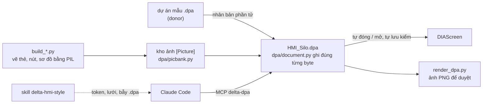

<h1 align="center">DIA_MCP_Sever</h1>
<p align="center">MCP server và bộ công cụ dựng màn hình HMI Delta DIAScreen bằng code.</p>

<p align="center">
  
  
  
  
</p>

Delta DIAScreen không có API. Bộ công cụ này mở thẳng file `.dpa`, đọc và ghi lại
**đúng từng byte**, nên màn hình HMI được dựng bằng script thay vì kéo thả: mặt thẻ,
nút và sơ đồ quy trình vẽ bằng Python, phần tử động nhân bản từ dự án mẫu rồi gắn
địa chỉ PLC. Một MCP server cho Claude Code đọc/sửa thiết kế, và một skill giữ cho
mọi trang cùng một phong cách.

## Cách hoạt động



1. **Vẽ phần tĩnh thành ảnh.** Khung thẻ, tiêu đề, đơn vị, đường ống, hình silo là một ảnh; nút Delta không tô phẳng được nên mặt nút cũng là ảnh render sẵn.
2. **Nhân bản phần tử động** từ dự án mẫu (ô số, nút, van, ô chọn) rồi chỉ sửa thuộc tính đã hiểu: vị trí, phông, địa chỉ, macro.
3. **Ghi file, cho DIAScreen tự lưu một vòng** và đọc lại để chắc editor nhận, rồi mở cho người duyệt.

## Bắt đầu nhanh

```powershell
git clone https://github.com/SangTDH-HT/DIA_MCP_Sever
cd DIA_MCP_Sever
pip install -r requirements.txt
powershell -File install-skill.ps1          # skill delta-hmi-style cho Claude Code

python render_dpa.py C:\OTL\SILO_Ban_Moi\HMI_Silo.dpa out   # vẽ mọi screen ra PNG
python build_fill_page.py C:\OTL\SILO_Ban_Moi\HMI_Silo.dpa C:\OTL\SILO_Ban_Moi\Icon_HMI
```

Đăng ký MCP trong `.mcp.json`:

```json
"delta-dpa": { "command": "python", "args": ["<repo>\\dpa_mcp.py"] }
```

> Script dựng trang cần các dự án mẫu (donor) nằm ở `C:\OTL\...` - đường dẫn ghi ở đầu mỗi
> script. File `.dpa` của khách hàng không nằm trong repo.

## Trong repo có gì

```
dpa/                    thư viện .dpa: document, model, edit, picbank, macro, editor
dpa_mcp.py              MCP server delta-dpa
build_silo_frame.py     khung chung: logo, user, thanh bên, tab, token màu, icon Lucide
build_fill_page.py      Home_Fill + mặt dùng chung (START/DỪNG, công tắc, ô chọn + popup)
build_home_pages.py     Home_Discharge (Xả liệu) + Home_Blend (Công thức)
build_setting_page.py   Settings: lưới 8 ô + 8 trang con
build_calibration_page.py  Hiệu chỉnh bồn cân
render_dpa.py           vẽ screen ra PNG từ kho ảnh của chính dự án (ảnh chỉ để duyệt ở máy, không commit)
skills/delta-hmi-style/ skill Claude Code: token, lưới 1024x600, thành phần, bẫy .dpa
docs/kien-thuc-dpa.md   định dạng .dpa và mọi lần vấp, kèm lý do
assets/lucide/          icon Lucide (ISC)
tests/                  round-trip byte-identical trên 14 dự án thật
```

## Phong cách

| | Token | |
|---|---|---|
|  | `#F3F5F8` | nền trang |
|  | `#1E2630` | chữ chính |
|  | `#4A84B6` | mục đang chọn, vạch tiêu đề |
|  | `#2BB57A` | START |
|  | `#F0405A` | DỪNG |
|  | `#2E9E48` | đường liệu |
|  | `#35C2C8` | đường chân không |

Phông Arial, thẻ bo 6 px viền 1 px không bóng, ô số luôn in đậm. Đầy đủ trong
[`skills/delta-hmi-style/SKILL.md`](skills/delta-hmi-style/SKILL.md).

---

# Tài liệu kỹ thuật

## MCP `delta-dpa`

Truy cập thiết kế `.dpa` bằng code, giống cách `Tia.exe` làm với TIA Portal —
đọc screen, đối tượng, địa chỉ PLC, macro nút bấm; sửa và ghi lại.

DIAScreen **không có API** (không COM, không typelib, không dòng lệnh). Nên
server này làm việc thẳng với file dự án.

## Cấu trúc file `.dpa`

```
offset 0    'BM'                    ảnh thumbnail Windows bitmap
offset 2    uint32 = 14             bfSize giả
offset 6    'PDAB'                  dấu nhận dạng của Delta
offset 14   BITMAPINFOHEADER        biSizeImage ở +34 cho biết ảnh dài bao nhiêu
offset 54   pixel ảnh
tiếp theo   luồng gzip              deflate mức 6, mtime 0, byte OS = 0x0b
bên trong   mỗi byte XOR 0x64       ra phần text của dự án
```

Phần text là dạng INI: `[Application] [Screen] [Element] [State] [SubMacro]
[Alarm] [Picture]`… Đối tượng thuộc về screen đứng ngay trước nó, `[State]`
đứng sau đối tượng là các trạng thái của nó.

Hai chỗ không phải text thuần, đọc theo **độ dài** chứ không theo dòng:

| Dạng | Ví dụ | Khung |
|---|---|---|
| Chữ UTF-16LE | `wTextLen0=28` | 28 byte, rồi một CRLF ngăn cách |
| Macro | `ButtonOnMacroLen=842` | 842 byte, CRLF nằm trong số đếm |
| Ảnh | `Size=2689151` | cả ngân hàng ảnh |

## Vì sao ghi lại được an toàn

Parser giữ nguyên từng byte: mọi thứ nó không hiểu được cất lại nguyên xi.
Test `test_round_trip_is_byte_identical` đọc rồi ghi lại **14 dự án thật**
(DOPSoft 4.00.10 → DIAScreen 6.6.2) và đòi file ra phải giống hệt file vào,
tính cả luồng gzip. Nhờ vậy một lệnh sửa chỉ đổi đúng chỗ cần đổi.

## Các lệnh

| Lệnh | Việc |
|---|---|
| `open_project(path)` | nạp `.dpa`, trả về panel, độ phân giải, PLC đang nối |
| `list_screens()` | mọi screen: id, tên, kích thước, số đối tượng |
| `layout(screen, kind)` | đổ đối tượng một screen: vị trí, kích thước, chữ, địa chỉ |
| `screenshot_text(screen)` | sơ đồ mặt bằng dạng chữ, xếp theo toạ độ |
| `element(screen, index)` | toàn bộ thuộc tính + trạng thái + macro của một đối tượng |
| `find(query)` | tìm khắp dự án theo địa chỉ PLC, chữ hiện, hay tên |
| `addresses()` | mọi địa chỉ thiết kế đụng tới, kèm chỗ dùng |
| `macros(screen)` | logic nút bấm dạng câu lệnh đọc được; bỏ trống thì trả sub-macro |
| `alarms()` | bảng cảnh báo |
| `set_property(...)` | đổi một thuộc tính: `X`, `Width`, `BgColor`, `ReadVar`… |
| `set_text(...)` | đổi chữ hiện trên đối tượng |
| `set_state_text(...)` | đổi chữ cả hai ngôn ngữ cùng lúc (Việt trước, Anh sau) |
| `clone_element(...)` | nhân bản một đối tượng sang screen khác — cách tạo mới |
| `clone_screen(...)` | thêm screen rỗng, chép thiết lập từ screen có sẵn |
| `delete_element(...)` | xoá một đối tượng và các trạng thái của nó |
| `rebind(old, new)` | dời hàng loạt địa chỉ PLC; mặc định chạy thử |
| `pending_changes()` | những gì đã sửa trong bộ nhớ, chưa ghi |
| `save(out_path, reload_editor)` | ghi ra file, tuỳ chọn nạp lại luôn trong editor |
| `editor_windows()` | DIAScreen đang mở những dự án nào |
| `reload_in_editor(path)` | đóng cửa sổ cũ và mở lại file vừa ghi |

## Luật an toàn

- `open_project` chỉ đọc, không khoá, không đụng file trên đĩa.
- Sửa nằm trong bộ nhớ cho tới khi `save`.
- `save` mặc định ghi ra file khác. Muốn đè file gốc phải
  `overwrite_source=True`, và luôn để lại bản `.bak`.
- **DIAScreen không khoá file** — ghi đè được ngay lúc nó đang mở. Nhưng nó
  không tự biết, nên sau khi ghi phải `reload_in_editor`, hoặc
  `save(..., reload_editor=True)`. Đừng bấm Save trong editor trước khi nạp
  lại: bản trong bộ nhớ nó cũ hơn, bấm Save là đè mất phần vừa ghi.
- `reload_in_editor` **không bao giờ trả lời hộp thoại**, và **kiểm hộp thoại
  TRƯỚC khi gửi lệnh đóng**. Lệnh đóng không rút lại được: gửi rồi mới phát
  hiện hộp thoại thì người dùng bị hỏi "có lưu không" một cách vô cớ, và bấm
  Lưu là bản cũ trong bộ nhớ editor đè mất file vừa ghi. Đang có hộp thoại mở
  thì nó từ chối, không gõ cửa.
- Nếu DIAScreen vẫn hỏi lưu sau đó: trả lời **KHÔNG**. Bản của nó cũ hơn file
  trên đĩa.
- `rebind` mặc định `dry_run=True`: xem danh sách trúng rồi mới chạy thật.

## Chạy

```
python dpa_mcp.py          # stdio MCP server
python -m pytest tests -q  # 30 test trên dự án thật
```

Đăng ký trong `.mcp.json` với tên `delta-dpa`.

## Tạo mới bằng cách nhân bản

Không dựng `[Element]` từ số không: một đối tượng thật mang vài chục thuộc tính
mà mình chưa hiểu hết, nên đối tượng mới luôn là bản sao sâu của một cái đang
chạy, rồi chỉ sửa những thuộc tính mình hiểu. `nPartsID` đánh số lại theo
screen đích, thứ tự section là thứ tự vẽ nên chèn sau cùng là nằm trên cùng.

`build_login.py` là ví dụ đầy đủ: dựng trang đăng nhập theo tông HOME của
OTL-30 vào một dự án Delta bất kỳ.

## Đã làm thêm (29–30/09/2026)

- **Macro mở/đóng popup**: `dpa/macro.screen_statement()` sinh `OPENSCREEN n` /
  `CLOSESUBSCREEN n` đúng từng byte như DIAScreen; `set_macro()` gán vào nút.
- **Kho ảnh** `[Picture]`: `dpa/picbank.py` đọc/ghi, `build_silo_frame.Bank` thêm ảnh,
  `prune_bank` dọn ảnh không còn dùng.

## Chưa làm

- **Ẩn/hiện theo bit cho Text**: cần thêm khoá `VisibleLink` + `VisibleVar`;
  thêm khoá mới vào section là cơ chế **chưa kiểm chứng** (`Section.set` chỉ sửa khoá có sẵn).
- **Macro tuỳ ý**: mới ghi được lệnh mở/đóng screen; lệnh gán, BITON… chưa.
